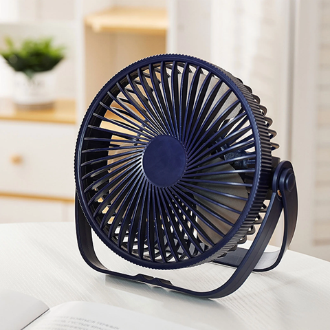
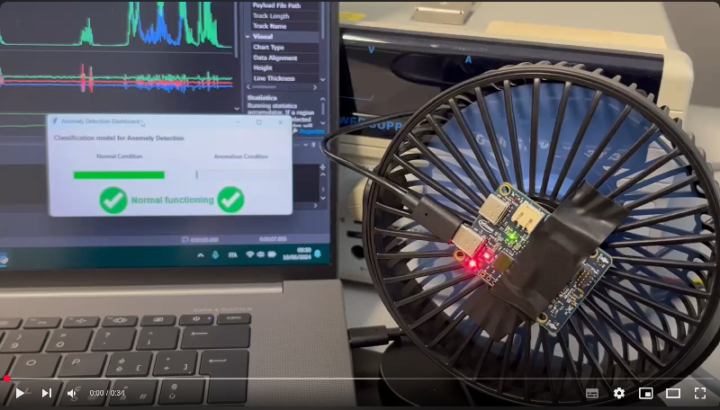
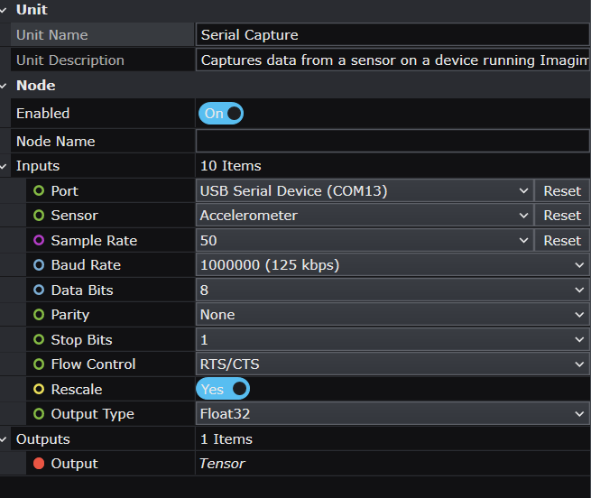
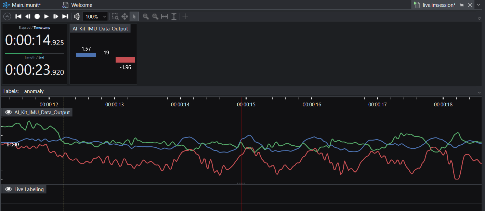
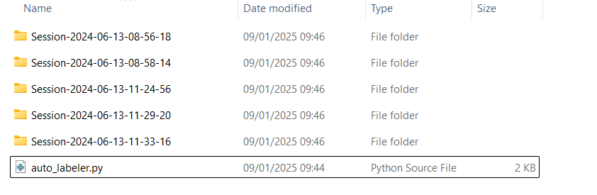
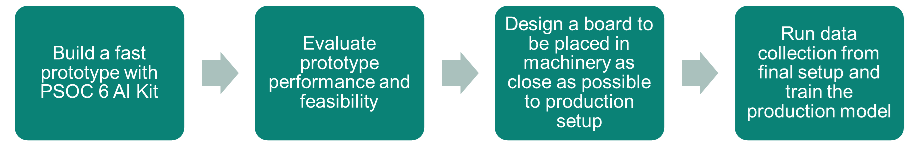

# Anomaly Detection for Vibrating Machinery - Starter Model Project

## Use-case description

This starter model aims to provide general guidance on how to develop an **anomaly detection system** for detecting anomalous behavior in machinery based on vibration measurements.
This project will monitor a simple desktop fan, but the same concept and workflow can be easily ported to any other machinery, whether industrial or consumer.

The task is framed as a **classification project**: a type of Supervised Learning where a model learns to classify data into a discrete number of classes. For this project, only two classes will be used: normal functioning and anomalous functioning. You will need to provide both normal and anomalous data for the machinery you want to monitor to build a robust classifier.

### How can I know if this project fits my use case?

You can use this starter project if:

- You need to monitor a machinery whose behavior can be inferred by its vibration;
- You have the possibility of collecting both normal functioning data and anomalous functioning data, either from an already faulty machine or by artificially inducing anomalies on a functioning machine.

If you don't have the possibility of collecting a sufficient amount of anomalous data from your machine, this approach might not provide accurate results.

### How can this project ease my go-to-production journey?

This project demonstrates how to approach classification-based vibration monitoring of a machine. If you start from this, you will have:

- A ready framework for performing vibration classification
- Preprocessor and data windowing are already set
- A useful script for fast data labeling
- Already generated model architectures for this task

## Contents

`Data` - Folder to put your data.

`Models` - Folder where trained models, their predictions, and generated Edge code are saved.

`Units`    - Folder where custom layers and pre-processors can be added. Not used in this project.

`Tools`    - Folder containing an auto-labeler script for easy labeling of data and the GraphUX Data Collection project.

`Tools/IMUDataCollectionProject` - Folder with the Data Collection GraphUX project you can use for collecting more data.

## Sensor settings specification

This starter project requires the [PSOC™ 6 AI Evaluation Kit](https://www.infineon.com/cms/en/product/evaluation-boards/cy8ckit-062s2-ai/). This platform is equipped with PSoC™ 6 MCU and IMU sensors. The board is designed for easy prototyping and lets you collect real-life data to easily build a compelling ML product fast.

The desktop fan is optional; you may want to collect data directly from your machinery instead. However, if you want to replicate the project out-of-the-box with a small desktop fan, any inexpensive product similar to the one shown will be suitable:

The PSOC 6 board, equipped with the vibration sensor, was simply taped to the center of the small desktop fan.

A video of the demo application can be found here:

## Collecting and expanding the dataset

To add more data, you need to flash and configure the [Imagimob Streaming Protocol Firmware](https://github.com/Infineon/mtb-example-imagimob-streaming-protocol/blob/master/README.md) on your AI Kit.
Follow the instructions in the README.md file of the ModusToolbox project to correctly configure and flash the board.

For starting data collection, navigate to the `Tools/IMUDataCollectionProject` folder and double-click the `Main.imunit` file.
Make sure you have correctly connected the PSOC6 AI Kit to your machine via the USB connector.

In the GraphUX, set the input parameters for the "Serial Capture" block to collect data via the IMU with the following settings:

Click the "Start" button on the toolbar to execute the GraphUX pipeline.
By clicking the "Record" button in the .imsession window, you should be able to record IMU data:

If needed, you can use the predefined "Anomaly" label to label the collected data.

Once you have completed data collection, you can save the sample in the `Data` folder or your preferred folder.

### A note on data labeling

This project uses only one label to frame the task as a binary classification problem.
Note that Deepcraft Studio introduces an "Unlabelled data" class by default, which we will use as "Normal" behavior data.
The only additional label needed is "anomaly", which represents anomalous data.

**Anomaly**: This label indicates that the machinery is operating anomalously.

**No Label**: Data without a label indicates that the machinery is operating as expected (normally).

### Using the script for fast labeling of data

In the `Tools` folder, you will find a Python script named `auto_labeler.py`.
This script allows you to automatically label all sessions in the same folder with the "anomaly" label.
This is particularly useful if you need to label sessions that you are sure contain only anomalous data.

The usage is straightforward.
Place the script in a folder containing all session folders with anomalous data, following this structure:

Simply run the script in your terminal to automatically label all sessions with the "anomaly" label.

**Note**: Make sure that the data you label with this system contains only anomalous data.
The script cannot distinguish anomalies and will simply label the entire length of the sessions with the "anomaly" label.

## Recommended path to production

To bring this project to a production-level system, follow these general steps:

The prototyping part is fundamental since it will allow you to state the feasibility of your task in a cheap and fast way. If you can get to a model able to reach satisfactory performance with a simple prototype (an example could be the PSOC 6 6 AI Kit simply taped to the machine you want to monitor, using it for collecting a small dataset), then you can be pretty confident that you'll be able to get a good result in production.

More in detail, the steps to be followed could look like this:

**1. Identify the machinery or component whose behavior you want to monitor**
   
  Ensure that you can run the machinery in both normal and abnormal conditions.
  Consider possible faults that could occur in the machine.
  If available, ensure that you have a faulty machine or prepare one to exhibit anomalous behavior.

**2. Collect data for a prototype application**
   
  Use the GraphUX project to collect a representative amount of data.
  Start with at least **40 minutes of data** for both normal and anomalous behavior and test system performance directly in Studio.
  Increase the data if you find the performance to be unsatisfactory, and try to include all possible anomalies that could happen.
  You can save data in the `Data` folder or create a new one if you don't want to keep the template data of this repo.
  Label the data or leverage the script for automated labeling of anomalous data to ease the job.

**3. Import your data and train the prototype model**

  Import the data you collected in the "Data" tab of the .improj file in Deepcraft Studio.
  You are now able to follow the standard Deepcraft Studio steps for processing, training, and deploying your Anomaly Detection model.
  The preprocessor is already set, and some models are already defined for you, which performance is guaranteed to be in real-time on the PSOC6 AI Kit.

  **4. Deploy and do a real-time test of your prototype model**

  Last thing to be done in prototyping phase is to deploy the firmware to the device by leveraging the template application already available in ModusToolbox:[MTB Example ML Imagimob MTBML Deploy](https://github.com/Infineon/mtb-example-ml-imagimob-mtbml-deploy) and test the firmware on the machinery. The UART terminal will show you real-time predictions on machine behavior.

  **5. Going to the production board system**

Last step is to move to the actual final production setup. The production system will likely have the MCU placed on a board inside the machine and the IMU sensor in a specific position, not necessarly the same one of the prorotyping phase. If you can go as close as possible to production conditions during prototyping phase, you will be able to deliver the same model also on the production board with little-to-no additional training or data needed. If this is not the case, you might need to do a new data collection step to allow the model to learn the nuances of the final setup. Follow again steps 2, 3 and 4 also for the production setup to reach a functioning application.

You may also leverage Deepcraft Studio's Transfer Learning features for fine-tuning the prototype model to production data. This could lead to better results and faster go-to-production times, but the usage of Transfer Learning is recommended only to experienced ML users.

**Note:** All subsequent ML system lifetime monitoring procedures must be defined and implemented by you according to you needs, requirements and targets.

## Getting Started

Please visit [developer.imagimob.com](https://developer.imagimob.com), where you can read about Imagimob Studio and go through step-by-step tutorials to get you quickly started.

## Help & Support

If you need support or if you want to know how to deploy the model on to the device, please submit a ticket on the Infineon [community forum ](https://community.infineon.com/t5/Imagimob/bd-p/Imagimob/page/1) Imagimob Studio page.