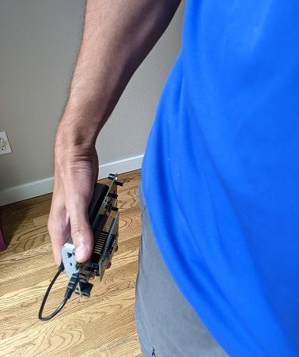
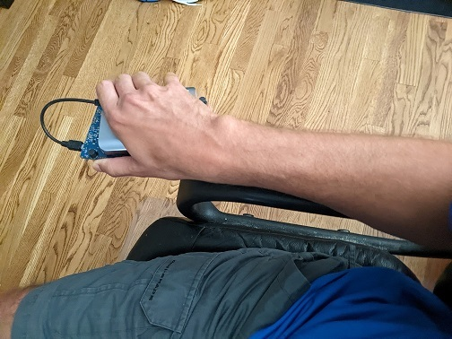
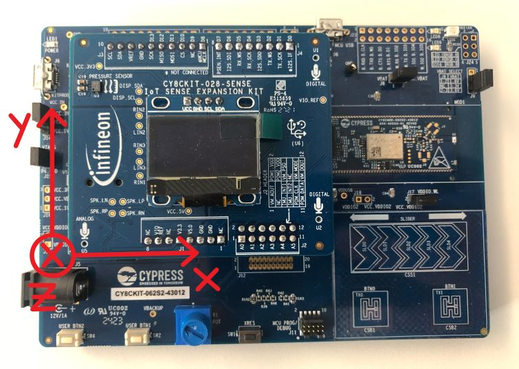

# Human Activity

## Overview

This starter model allows you to build a human activity detector that can be used on any supported Infineon MCU (or other MCUs) with a BMI160 IMU or another IMU. You can use this project as a starting point to develop a production ready model intended for deployment in wristed wearables. 

Below you can find code examples about how to deploy the output of this project to any supported Infineon MCU with a BMI160 IMU.

## Data and Classes

The IMU (Inertial Mesurement Unit - accelerometer and gyroscope) needs to be set up to collect data at 50 Hz using +/- 8g for the accelerometer scale and +/- 500 dps for the gyro scale.

The provided data consists of 99 recordings from 5 individuals.

The human activities (classes) to be detected are:

- Running
- Standing
- Walking
- Sitting
- Jumping

## Imagimob - Infineon Integration

You can find below guided code examples on how to use Imagimob AI together with Infineon hardware and software to collect data and deploy your models.

Additional info are available in the guide [Getting Started with MTBML and Imagimob Studio](https://www.infineon.com/dgdl/Infineon-Machine_learning_using_ModusToolbox_Imagimob_Studio-ApplicationNotes-v01_00-EN.pdf?fileId=8ac78c8c8a8d344a018aa850bb2d21b5).

### Required Hardware and Software

- [Infineon PSoC™ 62S2 Wi-Fi Bluetooth® Pioneer Kit (CY8CKIT-062S2-43012)](https://www.infineon.com/cms/en/product/evaluation-boards/cy8ckit-062s2-43012/)
- [Infineon IoT Sense Expansion Kit (CY8CKIT-028-SENSE)](https://www.infineon.com/cms/en/product/evaluation-boards/cy8ckit-028-sense/)
- [ModusToolbox™](https://www.infineon.com/cms/en/design-support/tools/sdk/modustoolbox-software/)
- [ModusToolbox™ for Machine Learning](https://www.infineon.com/cms/en/design-support/tools/sdk/modustoolbox-software/modustoolbox-machine-learning/)

### Data Collection Example

- [Imagimob Data Collection](https://github.com/Infineon/mtb-example-ml-imagimob-data-collection) - code example that demonstrates how to collect IMU data for your AI/ML project using Imagimob's [Capture Server](https://bitbucket.org/imagimob/captureserver/src/master/) and an [Infineon PSoC™ Pioneer Kit](https://www.infineon.com/cms/en/product/evaluation-boards/cy8ckit-062s2-43012/).

### Model Deployment Examples

- [Imagimob ModusToolbox ML Deploy](https://github.com/Infineon/mtb-example-ml-imagimob-mtbml-deploy) > code example that shows how to deploy Imagimob-generated machine learning models on an [Infineon PSoC™ Pioneer Kit](https://www.infineon.com/cms/en/product/evaluation-boards/cy8ckit-062s2-43012/) with the [ModusToolbox™](https://www.infineon.com/cms/en/design-support/tools/sdk/modustoolbox-software/) [Machine Learning (MTBML) Pack](https://www.infineon.com/cms/en/design-support/tools/sdk/modustoolbox-software/modustoolbox-machine-learning/)

- [Imagimob Deploy](https://github.com/Infineon/mtb-example-ml-imagimob-deploy) > code example that shows how to deploy Imagimob-generated machine learning models on an Infineon PSoC™ Pioneer or Evaluation Kit (see [list of supported kits](https://github.com/Infineon/mtb-example-ml-imagimob-deploy/tree/master#supported-kits-make-variable-target)) with [ModusToolbox™](https://www.infineon.com/cms/en/design-support/tools/sdk/modustoolbox-software/)

### Data Collection Setup Note

When using the [Infineon IoT Sense Expansion Kit](https://www.infineon.com/cms/en/product/evaluation-boards/cy8ckit-028-sense/) with IMU, to have the right orientation of the IMU axes, the board needs to be hold like in the pictures below for standing (left) and sitting (right).   

 

The IMU axes of the CY8CKIT-028-SENSE need to be oriented as shown in the picture below.

## Taking the Project Further

There are a number of ways to go forward once you have downloaded the project:

1. You can use this project as inspiration and collect your own data to build a project similar to it.

2. You can take the model, deploy it on a device and get a feeling for how this model would work in real-life. Make note though that this model was only trained on 5 individuals so it might need a bit more data to be able to generalise.

## Contents

`Data`  - Folder where data is located.

`Units`  - Folder where custom layers and pre-processors can be added.

`Models` - Folder where trained models, their predictions and generated Edge code are saved.

`Resources`  - Folder where additional files and tools can be added.

## Getting Started

Please visit [developer.imagimob.com](https://developer.imagimob.com), where you can read about Imagimob Studio and go through step-by-step tutorials to get you quickly started.

## Help & Support

If you need support or if you want to know how to deploy the model on to the device, please submit a ticket on the Infineon [community forum ](https://community.infineon.com/t5/Imagimob/bd-p/Imagimob/page/1) Imagimob Studio page.