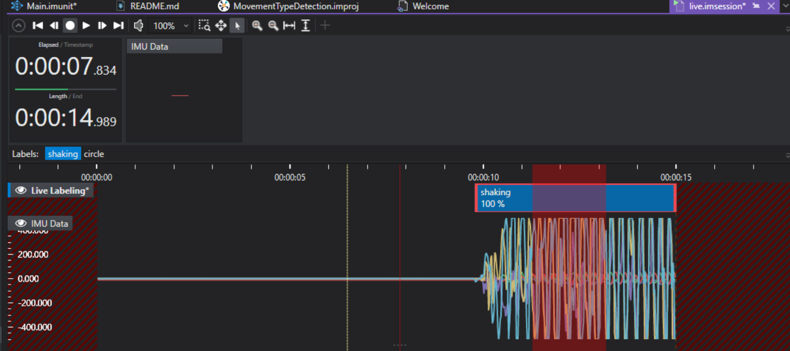

# Movement Type Detection w/ IMU

## Overview

This is a simple starter model capable of differentiating between 3 different movement types: circle, shaking and stationary based on the IMU (6-axis accelerometer and gyroscope) of the AI Evaluation Kit. Note that in this project, stationary is unlabelled. This project serves as a code example but can also be adapted and expanded if you have an interesting application. As is, the model performs well when differentiating between the clear movement types, but has some errors in edge cases where shaking and circle motions are similar (and indeed with no clear ground truth).

## Collection of Data
The data was collected from the built-in IMU on the AI-Eval kit (CY8CKIT-062S2-AI) held in hand and streamed into DEEPCRAFT Studio at 50Hz. The data collection was performed separately by two people. Considerations were taken to vary the frequencies of the shaking and circling motions, as well as incorporating a large number of transitions between the 3 states. It was ensured that the model had plenty of transition data by 5 second alternating: stationary, shaking, circle, shaking, stationary, shaking, stationary, circle. This ensures that all combinations of transitions are covered. Furthermore, for the circles the radius and direction of travel were also varied. 

## Adding More Data
Adding more data for the existing gesutres or adding another gesture is simple with the [AI-eval kit](https://www.infineon.com/cms/en/product/evaluation-boards/cy8ckit-062s2-ai/). 
First, you need to flash and configure the [Imagimob Streaming Protocol Firmware](https://github.com/Infineon/mtb-example-imagimob-streaming-protocol/blob/master/README.md) on your AI Kit.

Connecting this to DEEPCRAFT Studio allows you to stream the data directly, and then labelling it. See below for the setup in GraphUX.

Click the "Start" button on the toolbar to execute the GraphUX pipeline.
By clicking the "Record" button in the .imsession window, you should be able to record IMU data:

When adding more motions, make sure to cover all possible transitions between gestures. 
If you have a practical application and wish to go into production you might want to create a label that corresponds to no distinct motion, i.e when it is idle. In this case you will have to go through the existing data and label all the currently unlabelled data as 'stationary'. 
It is recommended to have a minimum of 100 seconds of data per label, preferably more.
More detailed instructions on collecting data can be found [here](https://developer.imagimob.com/data-preparation/data-collection).

## Steps to Production
The recommended path to production for this starter model is to identify what motions you want to identify. If your application requires a class for no distinct motion, go through the existing data and create labels for 'Stationary' to replace the existing unlabelled data. This choice should be given some thought. Collect data for your application as outlined above, in a situation that is as representative as your final use case as possible. Next you should think about what motions you want to ignore, and incorporate negative data for those.
When all the data collection is done, you might want to add preprocessing steps - currently the model only has a sliding window. If your motions have a set expected frequency then this could be leveraged. For the sliding window size, you should have considerations for the inference time requirements of your model, a longer window results in a longer inference time. 
After evaluating the model, you might realize that your model performs poorly in certain situations; there are no set solutions for this, but adding representative data could help.
## Getting Started

Please visit [developer.imagimob.com](https://developer.imagimob.com), where you can read about Imagimob Studio and go through step-by-step tutorials to get you quickly started.

## Help & Support

If you need support or if you want to know how to deploy the model on to the device, please submit a ticket on the Infineon [community forum ](https://community.infineon.com/t5/Imagimob/bd-p/Imagimob/page/1) Imagimob Studio page.